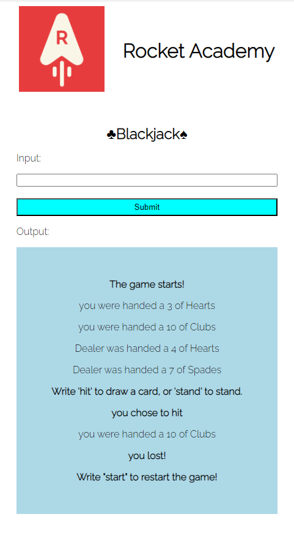

# Blackjack Game

This is a simple implementation of the popular card game Blackjack. The game is built using HTML, CSS, and JavaScript.

Click [here](https://jhonnynd.github.io/blackjack-j/) for a live demo.

## How to Play

1. Open the `index.html` file in your web browser.
2. Enter "start" to begin the game.
3. Follow the prompts to play the game. Enter "hit" to draw another card, "stand" to end your turn, or "start" to restart the game.

## Features

- Random card dealing and shuffling of the deck.
- Dealer logic to determine the outcome of the game.
- Responsive on mobile

## Technologies Used

- HTML
- CSS
- JavaScript

## Screenshots

